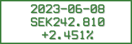

# line-go-up
Keep track of my investments

# LANDMINE

No step on program. Program go boom!

# Wait, what?

I have a small amount of money squirreled away for a rainy day, in a fund. I don't want to obsess over it, as it's really not a huge deal, but I also want to keep an eye on it over time.

To do this, I use a homescreen widget on my phone to download a PNG from a webserver running this program.

The result, in true Developer Art style, looks like so:  

# Cool, can I use it?

Well, unless you own parts of the same fund, and bought in at the exact same time I did, it's not very useful.

Feel free to fork the repository and edit it to show your own data, of course. Hooray for FOSS!

# Documentation, though?

Yeah, the documentation is currently severely lacking. Hopefully I'll improve that over time.  
There is also *exactly zero* tests, currently.

Hell, there isn't even any meaningful output from the program, so when it blows up in my face, I'll likely have no idea why.

Fun!
